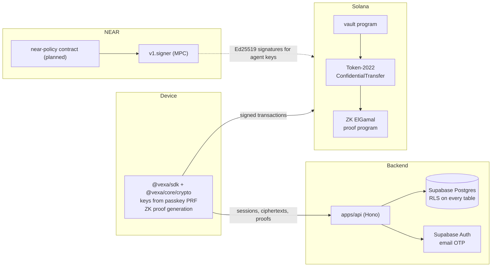
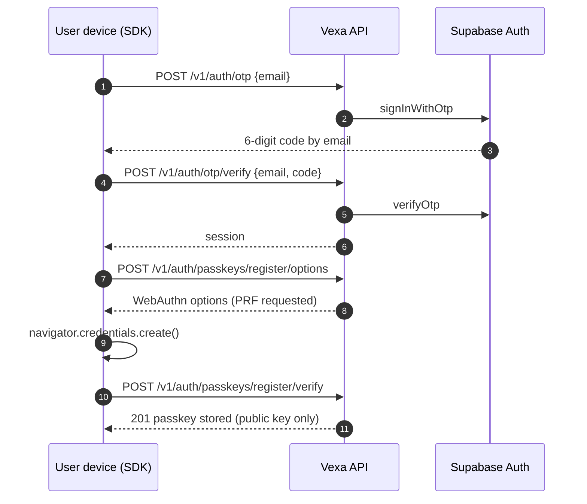
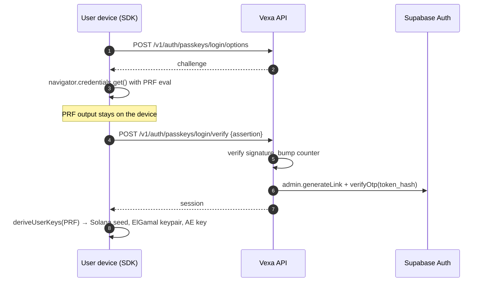
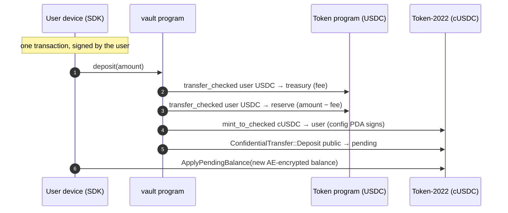
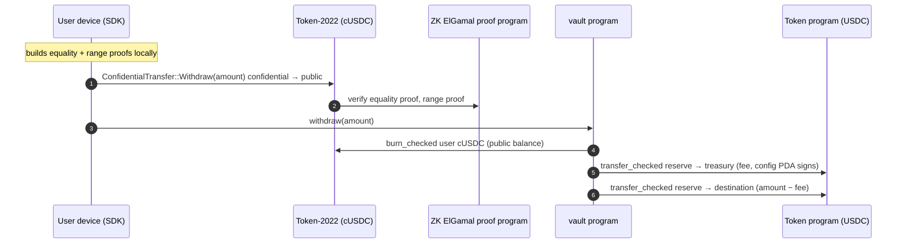

# Architecture

This document describes how Vexa's pieces fit together and why. It grows with each release. Sections marked _planned_ describe the intended design of features that haven't shipped yet.

## Principles

1. **The server never knows an amount.** Balances and transfer amounts exist only as ElGamal ciphertexts outside the user's device. Proofs are built client-side. The schema has no numeric amount column on transfers, the logger redacts `amount` fields, and the review checklist asks about it on every PR.
2. **The server never holds a user key.** User keys are derived on-device from a passkey. The only private keys the backend holds are its own: a fee payer that sponsors transaction fees and an admin key for the vault.
3. **Every create is idempotent.** Money-moving requests will be retried by flaky networks and impatient users; a retry must never mean a second transfer.
4. **On-chain is the source of truth.** The database mirrors what the chain and the NEAR contract enforce, for search and dashboards, and never overrides them.

## Components



## Identity and keys

### Sign-up and passkey registration



### Passkey sign-in and key derivation



Supabase has no "sign in as this user" call, so after verifying the passkey the API mints a one-time magic-link token with the admin API and redeems it server-side. The token never leaves the process.

### Handle claim

The SDK signs a claim message with the user's Solana key. The message binds the handle, the user id and both public keys, so it can't be replayed for another account or another name. `claim_handle()` then registers the handle and binds the keys in a single transaction.

## Money

### Deposit (vault)



The deposit amount is public, since it's a USDC transfer. From the moment it becomes cUSDC it's part of an encrypted balance.

### Withdraw (vault)



### Protocol fee

The vault charges 0.10% of each deposit and withdrawal, capped at 5 USDC, in USDC, to the treasury's USDC account. The schedule lives in a second PDA, `["fees"]`: rate, cap, treasury, and up to four $VEXA discount tiers. The admin sets it with `SetFees` (`pnpm vault:set-fees`); the program rejects any rate above 1%, and refuses deposits and withdrawals until a schedule exists rather than run without one.

Charging on the vault's edges is a deliberate choice. Deposit and withdrawal amounts are public anyway, so the program can compute the fee itself and nobody can route around it. A fee on confidential transfers would need a second transfer to the treasury plus a percentage-with-cap proof binding the two, roughly doubling a transfer's transactions, and the fee's size would itself reveal something about the amount.

The rate is rounded up, so every movement pays at least one base unit; otherwise splitting a deposit into dust would dodge the fee on transactions Vexa sponsors. $VEXA discounts are read from the owner's own token account, passed as an optional last account, so the program checks the balance itself. `quoteFee` in `@vexa/core/solana` repeats the arithmetic to the base unit so a device can show the fee and encrypt its new balance for what actually lands.

### Invariants the vault enforces

- The config PDA is the only cUSDC mint authority and the only owner of the USDC reserve.
- Every mint is paired with a USDC transfer in; every USDC release is paired with a burn. Fees go to the treasury and never pass through the reserve, so the reserve equals the cUSDC supply.
- The cUSDC mint has no freeze authority and no extensions besides ConfidentialTransfer, so nobody can freeze or seize balances.
- Only the program's upgrade authority can initialize it, which closes the window in which a freshly deployed program could be initialized with a hostile mint.

### Proof compatibility

Mainnet validators verify proofs with the `solana-zk-sdk` version built into their Agave release (7.x for Agave 4.3). A proof generated with a different major version fails with an algebraic-relation error. The vault tests generate proofs with the exact version mainnet uses, and `@solana/zk-sdk` 0.5.3 (the WASM build the SDK uses) produces proofs that mainnet accepts. This was verified by simulating one against mainnet.

### Confidential transfer

Proofs are too big for one Solana transaction (about 1.9 KB against a 1232-byte limit), so each is verified into a _context state account_ first and the transfer reads them from there. The fee payer is the contexts' authority, which keeps the range-proof transaction at 1207 bytes, and closes them in the last transaction, getting their rent back.

```mermaid
sequenceDiagram
  autonumber
  participant D as Sender device (SDK)
  participant A as Vexa API
  participant S as Solana

  D->>A: POST /v1/transfers/prepare {to: "@bob"}
  A-->>D: transferId, Bob's ElGamal key and cUSDC account
  D->>A: GET /v1/balance
  A-->>D: sender's balance ciphertexts
  Note over D: decrypt balance locally, build equality,<br/>validity and range proofs, encrypt memo,<br/>compile and sign the 4-transaction plan
  D->>A: POST /v1/transfers/submit {plan}
  A->>A: sponsorship policy; ciphertexts bound to sender, Bob, auditor
  A->>S: 1 create 3 proof contexts
  par
    A->>S: 2a verify equality + validity
  and
    A->>S: 2b verify range (1207 bytes)
  end
  A->>S: 3 Transfer reading the contexts, close contexts
  A->>A: store grouped ciphertexts, emit transfer.settled
  A-->>D: 201
```

Bob's funds land in his _pending_ balance. He can read the amount straight away from the grouped ciphertexts (his handle is index 1), and applies the pending balance, or the SDK does it for him, before spending it.

### Sponsored transactions

Users hold USDC and no SOL, so Vexa's fee payer pays every network fee and some rent. It only co-signs a transaction that passes an allow-list (`apps/api/src/chain/sponsor.ts`). The fee payer may appear only:

- as fee payer;
- funding a proof context account, owned by the ZK ElGamal proof program, of a known size, with exactly its rent-exempt lamports;
- sending exactly one confidential account's rent to the user, in an account-opening plan, only while that account doesn't exist;
- as a proof context's authority, and as authority and refund destination when closing one.

Token and vault instructions may only debit the caller's own account; a transfer may only pay the recipient named at prepare time. Every context a plan creates must be closed by the same plan. Lookup tables, unknown programs and oversized transactions are refused. Each transaction is simulated before sending, so a malformed one costs nothing, and if a plan fails halfway the API closes its open contexts itself.

What sponsorship costs Vexa: an account opening is 0.00303 SOL of rent (3,032,760 lamports), once per user; after that, a deposit, transfer or withdrawal costs only transaction fees (a 4-transaction transfer is roughly 0.00004 SOL). Creating a USDC account for a withdrawal destination is never sponsored.

### Deposits made outside the API

Deposits are signed by users, so one can reach the vault without going through `POST /v1/deposits`. The Alchemy webhook watches the reserve; the indexer records any vault deposit it hasn't seen, attributing it to the registered wallet in the transaction, and emits `deposit.confirmed`. Notifications queue in `chain_events` and are retried with backoff before being parked as dead.

## Planned

### Agent accounts (Phase 3)

Each agent gets a Solana address derived by NEAR chain signatures (path `vexa-agent-{id}`). The agent's transactions are only signed by the MPC network after the `near-policy` contract checks them: a single confidential transfer from the agent's account, within the rolling 24-hour limit and the per-request cap, to an allowed recipient.

### Stealth transfers (Phase 3)

Funds go to a one-time address, are swapped through NEAR Intents 1Click from USDC to ZEC into a shielded address, then back to USDC at a fresh address for the recipient, and re-deposited. Every leg has a timeout and a refund path.

### View keys (Phase 3)

Transfers are also encrypted to the mint's auditor key. A view key is a wrapped, range-scoped grant that lets its holder decrypt those auditor ciphertexts for transfers inside the date range, and is revocable at any time.
