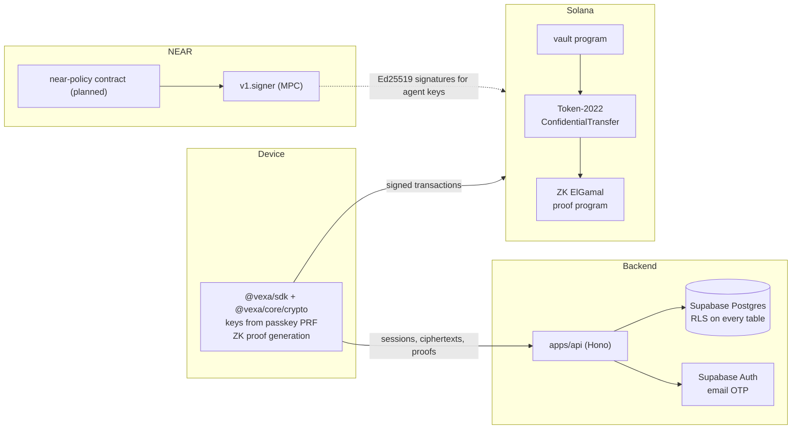
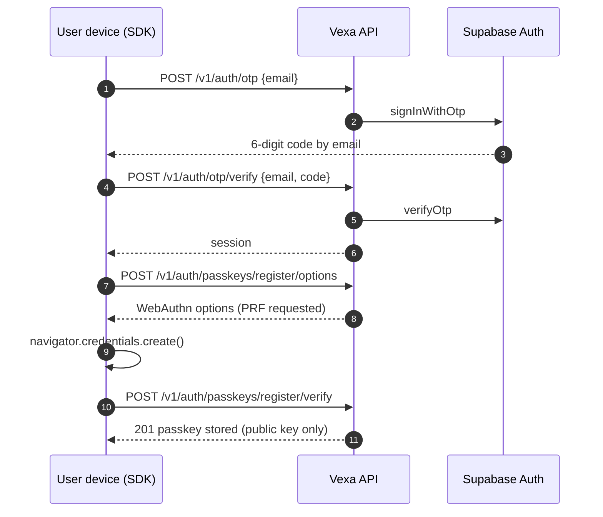
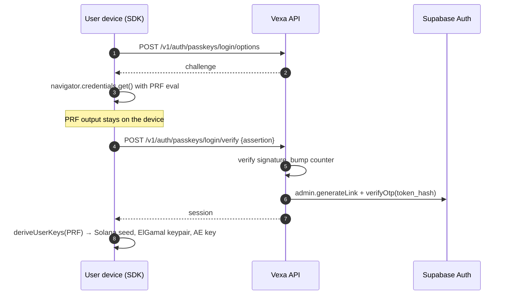
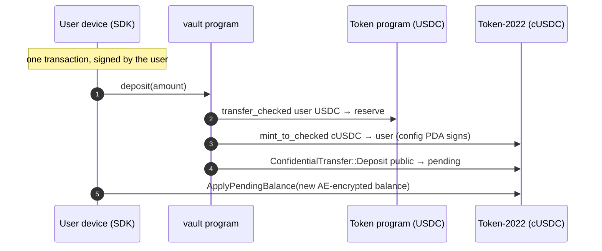
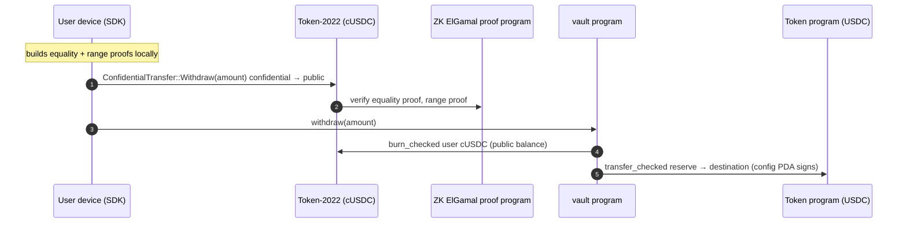

# Architecture

This document describes how Vexa's pieces fit together and why. It grows with each release. Sections marked _planned_ describe the intended design of features that haven't shipped yet.

## Principles

1. **The server never knows an amount.** Balances and transfer amounts exist only as ElGamal ciphertexts outside the user's device. Proofs are built client-side. The schema has no numeric amount column on transfers, the logger redacts `amount` fields, and the review checklist asks about it on every PR.
2. **The server never holds a user key.** User keys are derived on-device from a passkey. The only private keys the backend holds are its own: a fee payer that sponsors transaction fees and an admin key for the vault.
3. **Every create is idempotent.** Money-moving requests will be retried by flaky networks and impatient users; a retry must never mean a second transfer.
4. **On-chain is the source of truth.** The database mirrors what the chain and the NEAR contract enforce, for search and dashboards, and never overrides them.

## Components

## Identity and keys

### Sign-up and passkey registration

### Passkey sign-in and key derivation

Supabase has no "sign in as this user" call, so after verifying the passkey the API mints a one-time magic-link token with the admin API and redeems it server-side. The token never leaves the process.

### Handle claim

The SDK signs a claim message with the user's Solana key. The message binds the handle, the user id and both public keys, so it can't be replayed for another account or another name. `claim_handle()` then registers the handle and binds the keys in a single transaction.

## Money

### Deposit (vault)

The deposit amount is public, since it's a USDC transfer. From the moment it becomes cUSDC it's part of an encrypted balance.

### Withdraw (vault)

### Invariants the vault enforces

- The config PDA is the only cUSDC mint authority and the only owner of the USDC reserve.
- Every mint is paired with a USDC transfer in; every USDC release is paired with a burn.
- The cUSDC mint has no freeze authority and no extensions besides ConfidentialTransfer, so nobody can freeze or seize balances.
- Only the program's upgrade authority can initialize it, which closes the window in which a freshly deployed program could be initialized with a hostile mint.

### Proof compatibility

Mainnet validators verify proofs with the `solana-zk-sdk` version built into their Agave release (7.x for Agave 4.3). A proof generated with a different major version fails with an algebraic-relation error. The vault tests generate proofs with the exact version mainnet uses, and `@solana/zk-sdk` 0.5.3 (the WASM build the SDK uses) produces proofs that mainnet accepts. This was verified by simulating one against mainnet.

## Planned

### Confidential transfers between handles (Phase 2)

`POST /v1/transfers/prepare` resolves the recipient's ElGamal key and returns the unsigned instruction skeleton; the SDK builds the equality, ciphertext-validity and range proofs with the sender's keys and signs; `POST /v1/transfers/submit` co-signs as fee payer and broadcasts. Large proofs go into context-state accounts to stay within transaction size limits.

### Agent accounts (Phase 3)

Each agent gets a Solana address derived by NEAR chain signatures (path `vexa-agent-{id}`). The agent's transactions are only signed by the MPC network after the `near-policy` contract checks them: a single confidential transfer from the agent's account, within the rolling 24-hour limit and the per-request cap, to an allowed recipient.

### Stealth transfers (Phase 3)

Funds go to a one-time address, are swapped through NEAR Intents 1Click from USDC to ZEC into a shielded address, then back to USDC at a fresh address for the recipient, and re-deposited. Every leg has a timeout and a refund path.

### View keys (Phase 3)

Transfers are also encrypted to the mint's auditor key. A view key is a wrapped, range-scoped grant that lets its holder decrypt those auditor ciphertexts for transfers inside the date range, and is revocable at any time.
